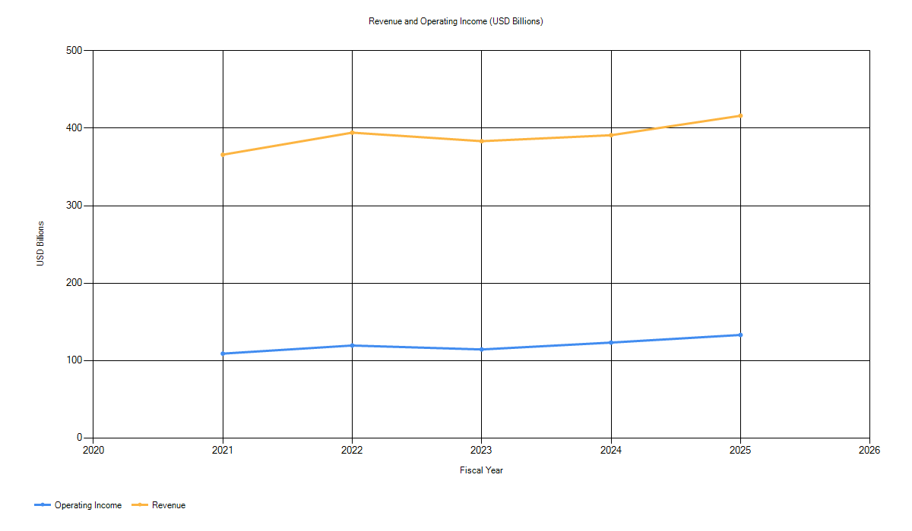
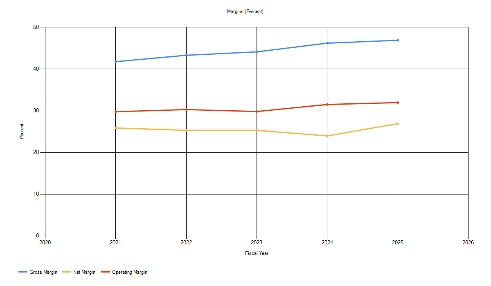
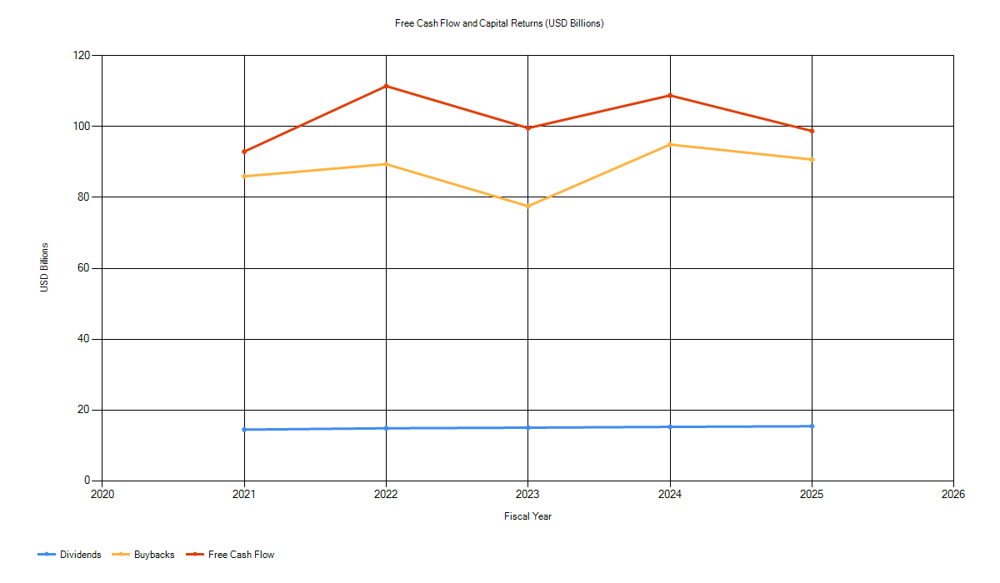
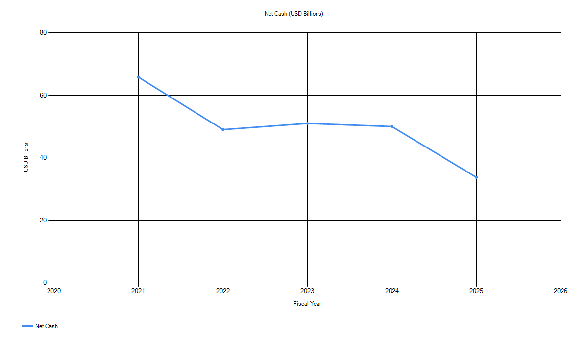
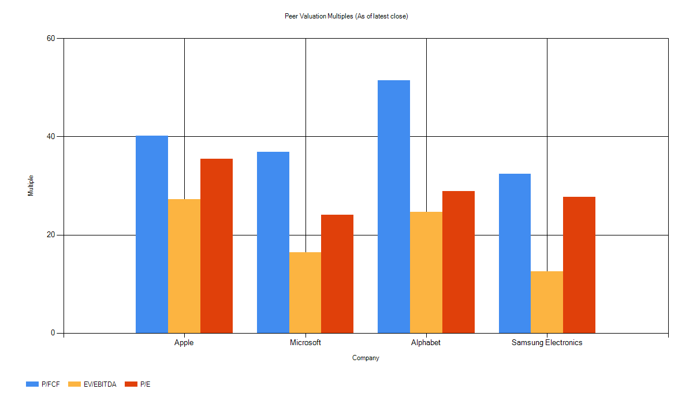
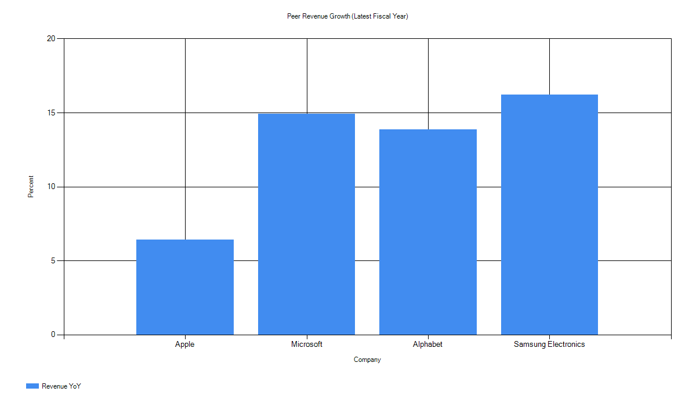
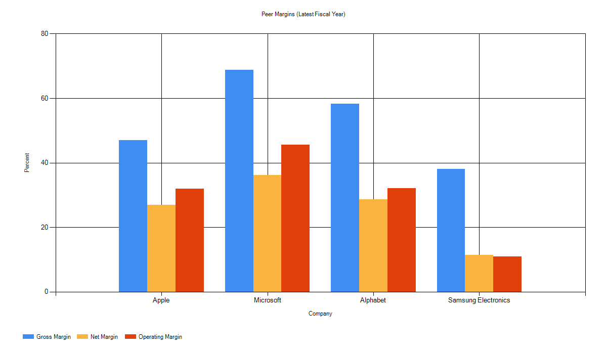

# Apple Fundamentals Report

## Executive Summary
- FY2025 revenue was $416.161B with YoY growth of 6.43%.
- Profitability remained strong with FY2025 gross margin 46.9%, operating margin 32.0%, and net margin 26.9%.
- FY2025 free cash flow was $98.767B with FCF conversion of 0.882.
- Net cash at FY2025 was $33.763B; liquidity ratios remained below 1.0 (current ratio 0.893).
- Capital returns remained large (FY2025 buybacks $90.711B, dividends $15.421B).
- Valuation snapshot (2026-02-20 close) implies elevated multiples vs cash flow yields.
- A simplified DCF base case produces an illustrative equity value per share below the snapshot price, implying higher growth/margins are priced in.

## Business Overview
Source notes: `research/notes_business_overview.md`
- Apple sells hardware (iPhone, Mac, iPad, wearables, home devices, accessories) and services (advertising, AppleCare, cloud services, digital content, payment services).
- The Company manages its business by geography: Americas, Europe, Greater China, Japan, Rest of Asia Pacific.
- Distribution: direct channels (retail/online/direct sales) and indirect channels (carriers/resellers); FY2025 net sales mix was 40% direct and 60% indirect.

The portfolio mix underscores a large device installed base that supports services revenue. Services are delivered primarily through Apple platforms (App Store, subscriptions, cloud, payments), while product cycles remain the main driver of absolute revenue changes. Geographic segmentation reflects exposure to macro and FX conditions across major regions, with the Americas and Europe providing the majority of sales.

Strategy emphasis in the FY2025 10-K highlights pricing pressure, ongoing innovation and R&D, supply chain resilience, and continued services expansion. The business model is reinforced by ecosystem interdependence: services usage increases device stickiness, and device adoption expands the services addressable base.

FY2025 net sales by product (USD billions):
|Product|NetSales|
|---|---|
|iPhone|209.586|
|Mac|33.708|
|iPad|28.023|
|Wearables, Home and Accessories|35.686|
|Services|109.158|
|Total|416.161|

FY2025 net sales by geography (USD billions):
|Region|NetSales|
|---|---|
|Americas|178.353|
|Europe|111.032|
|Greater China|64.377|
|Japan|28.703|
|Rest of Asia Pacific|33.696|
|Total|416.161|

## Financials
### Income Statement (USD billions)
|FiscalYear|Revenue|GrossProfit|OperatingIncome|NetIncome|
|---|---|---|---|---|
|2025|416.161|195.201|133.05|112.01|
|2024|391.035|180.683|123.216|93.736|
|2023|383.285|169.148|114.301|96.995|
|2022|394.328|170.782|119.437|99.803|
|2021|365.817|152.836|108.949|94.68|

One-time item note:
- FY2024 included a one-time net income tax charge of $10.2B related to the EU State Aid decision (see `data/one_time_items_notes.md`).

### Balance Sheet (USD billions)
|FiscalYear|CashAndEquivalents|MarketableSecurities|MarketableSecuritiesNoncurrent|TotalDebt|TotalEquity|
|---|---|---|---|---|---|
|2025|35.934|18.763|77.723|98.657|73.733|
|2024|29.943|35.228|91.479|106.629|56.95|
|2023|29.965|31.59|100.544|111.088|62.146|
|2022|23.646|24.658|120.805|120.069|50.672|
|2021|34.94|27.699|127.877|124.719|63.09|

Debt and liquidity notes (FY2025 10-K):
- Fixed-rate notes outstanding: $91.3B with $12.4B due within 12 months.
- Future interest payments on notes: $37.0B total, $2.6B due within 12 months.
- Commercial paper outstanding: $8.0B due within 12 months.
- Interest rate sensitivity: +100 bps implies +$129M annual interest expense for term debt.

### Cash Flow (USD billions)
|FiscalYear|CFO|Capex|Buyback|Dividends|
|---|---|---|---|---|
|2025|111.482|12.715|90.711|15.421|
|2024|118.254|9.447|94.949|15.234|
|2023|110.543|10.959|77.55|15.025|
|2022|122.151|10.708|89.402|14.841|
|2021|104.038|11.085|85.971|14.467|

## Charts
Source: `data/*.csv` (derived from SEC data.sec.gov). Period: FY2021-FY2025. Generated with `scripts/build_charts.ps1`.

## Metrics
### Profitability
|FiscalYear|GrossMargin|OperatingMargin|NetMargin|
|---|---|---|---|
|2025|0.4691|0.3197|0.2692|
|2024|0.4621|0.3151|0.2397|
|2023|0.4413|0.2982|0.2531|
|2022|0.4331|0.3029|0.2531|
|2021|0.4178|0.2978|0.2588|

### Growth
|FiscalYear|RevenueYoY|
|---|---|
|2025|0.0643|
|2024|0.0202|
|2023|-0.028|
|2022|0.0779|
|2021||

### Balance Sheet and Liquidity
|FiscalYear|ROA|ROE|ROIC|NetCash|CurrentRatio|QuickRatio|
|---|---|---|---|---|---|---|
|2025|0.3118|1.5191|0.975|33.763|0.8933|0.8588|
|2024|0.2568|1.6459|0.922|50.021|0.8673|0.826|
|2023|0.2751|1.5608|0.7978|51.011|0.988|0.9444|
|2022|0.2829|1.9696|0.812|49.04|0.8794|0.8472|
|2021|0.2697|1.5007|0.7127|65.797|1.0746|1.0221|

### Cash Flow Quality
|FiscalYear|FCF|FCFConversion|CapexPctRevenue|EBITDA|EBITDAMargin|
|---|---|---|---|---|---|
|2025|98.767|0.8818|0.0306|144.748|0.3478|
|2024|108.807|1.1608|0.0242|134.661|0.3444|
|2023|99.584|1.0267|0.0286|125.82|0.3283|
|2022|111.443|1.1166|0.0272|130.541|0.331|
|2021|92.953|0.9818|0.0303|120.233|0.3287|

## Competitive Landscape and Risks
Source notes: `research/notes_competitive_risks.md`
- Competitive intensity is high across hardware and services, with aggressive pricing and short product cycles.
- Component supply risks persist due to limited-source parts and competition for supply.
- Geographic exposure introduces macro and FX sensitivity.

Platform and regulatory exposure are structurally important because digital services depend on App Store distribution and on-device monetization. Changes to platform rules, privacy regulation, or payment policies could alter services economics. These risks are directional inferences from the 10-K risk factors and should be re-validated against the latest regulatory actions.

Greater China remains a meaningful contributor to revenue (15.47% in FY2025) and experienced a YoY decline, which adds sensitivity to regional demand trends and competitive dynamics.

## Management and Governance
Source notes: `research/notes_management_governance.md`
- 2026 proxy lists eight director nominees, with the Board indicating all directors except the CEO are independent.
- 2025 say-on-pay received 92% support.

Committee composition in the 2026 proxy shows continued emphasis on independent oversight across audit/finance, compensation, and governance. Shareholder proposals in 2026 include a request for a China entanglement audit, indicating ongoing stakeholder focus on geopolitical and supply chain risk.

## Valuation Snapshot
|AsOfDate|Price|MarketCapBillions|EnterpriseValueBillions|PE|EV_EBITDA|EV_FCF|P_FCF|BuybackYield|DividendYield|PayoutRatio|TotalPayoutRatio|
|---|---|---|---|---|---|---|---|---|---|---|---|
|2026-02-20|264.58|3969.9435|3936.1805|35.4428|27.1933|39.8532|40.195|0.0228|0.0039|0.1377|0.9475|

## Non-Recurring Items and Multiples
- **FY2025 (latest year, used for snapshot multiples):** No material one-time items identified. The P/E of 35.4 and other multiples reflect clean operating earnings.
- **FY2024 impact on trailing comparisons:** The $10.2B one-time EU State Aid tax charge reduced FY2024 reported net income to $93.7B. Excluding the charge, adjusted FY2024 net income would be ~$103.9B. This means:
  - Reported FY2024 to FY2025 net income growth appears +19.5%, but adjusted growth is ~+7.8%.
  - FY2024 FCF conversion of 1.16x (vs. typical ~1.0x) is inflated because the tax charge reduced reported net income while cash flow was unaffected (the $15.8B payment to Ireland occurred in FY2024 Q4 but was classified as an investing outflow per the escrow arrangement).
- **Conclusion:** Current snapshot multiples (based on FY2025) are not distorted by one-time items. However, YoY growth comparisons vs FY2024 should be interpreted with the EU tax charge in mind.

## Valuation Context
- Peer median multiples (Apple, Microsoft, Alphabet, Samsung): P/E 28.28, EV/EBITDA 20.59, P/FCF 38.54.
- Apple current multiples vs peer median: P/E and EV/EBITDA remain above the peer median; P/FCF is also above median.
- Historical context: Macrotrends provides multi-year series for Apple P/E and price-to-free-cash-flow; use those charts for historical range context.

Peer multiples chart (as of latest closes shown in sources; see `data/peer_multiples.csv` and `research/peer_multiples_sources.md`):

## Peer Fundamentals
Source: `data/peer_fundamentals.csv` and `research/peer_fundamentals_sources.md` (latest fiscal years for each peer).

## Quantified Sensitivities (FY2025)
- 1% change in revenue implies about B revenue swing.
- 100 bps change in gross margin implies about B change in gross profit.
- 100 bps change in operating margin implies about B change in operating income.
- At FY2025 net margin of 26.9%, a 1% revenue swing implies about B net income impact.

## DCF Base Case (Illustrative)
Source: `models/dcf_summary.md`, `models/dcf_scenarios.csv`, `models/dcf_sensitivity.csv`
- Equity value per share (illustrative): $141.61
- Key assumptions: 3% revenue growth, 31.5% EBIT margin, 8.0% WACC, 2.5% terminal growth.
- This DCF is simplified and intended as a sensitivity anchor rather than a definitive valuation.
- Scenario range (bull/base/bear): $194.05 / $141.61 / $96.11 per share.
- The 2026-02-20 close price of $264.58 is above the base and bull scenarios, implying the market is pricing in higher growth or margins than the base case.

## Thesis and Scenarios
Source notes: `research/notes_thesis_scenarios.md`
- Bull: services mix expansion and stronger upgrade cycles drive higher growth.
- Base: low single-digit growth with stable margins and continued capital returns.
- Bear: price pressure and slower device demand compress margins and growth.

Key KPIs to monitor each quarter include total revenue growth, services mix, iPhone cycle strength, and margin stability. Capital return pace (buybacks and dividends) is a key indicator of management confidence and capital discipline.

## Appendix
- Data sources: `research/sec/`, `research/market_price_source.txt`, `research/peer_multiples_sources.md`.
- Assumptions and calculations: `data/`, `models/dcf_summary.md`.
- Reconciliation checks: `data/reconciliation_notes.md`, `data/reconciliation_balance_sheet.md`, `data/reconciliation_cashflow.md`.
- Latest filings log: `outputs/key_events.md`.
- Data freshness: `outputs/freshness_report.md`.
- Change log: `outputs/change_log.md`.
- Drift alerts: `outputs/drift_alerts.md`.
- Scenario stress: `outputs/scenario_stress.md`.
- Report pack log: `outputs/run_log.md`.
- Refresh status: `outputs/refresh_status.md`.
- Quick review: `outputs/quick_review.md`.
- Cleanup plan (dry run): `outputs/cleanup_plan.md`.
- Health check: `outputs/health_check.md`.
- Summary JSON: `outputs/summary.json`.
- Export bundle: `outputs/export_bundle.zip`.
- Outputs manifest: `outputs/manifest.json`.
- CI run log: `outputs/run_log_ci.md`.
- Sanity checks: `outputs/sanity_checks.md`.
- Data dictionary: `outputs/data_dictionary.md`.
- Release notes: `outputs/release_notes.md`.
- Benchmark snapshot: `outputs/benchmark_snapshot.md`.
